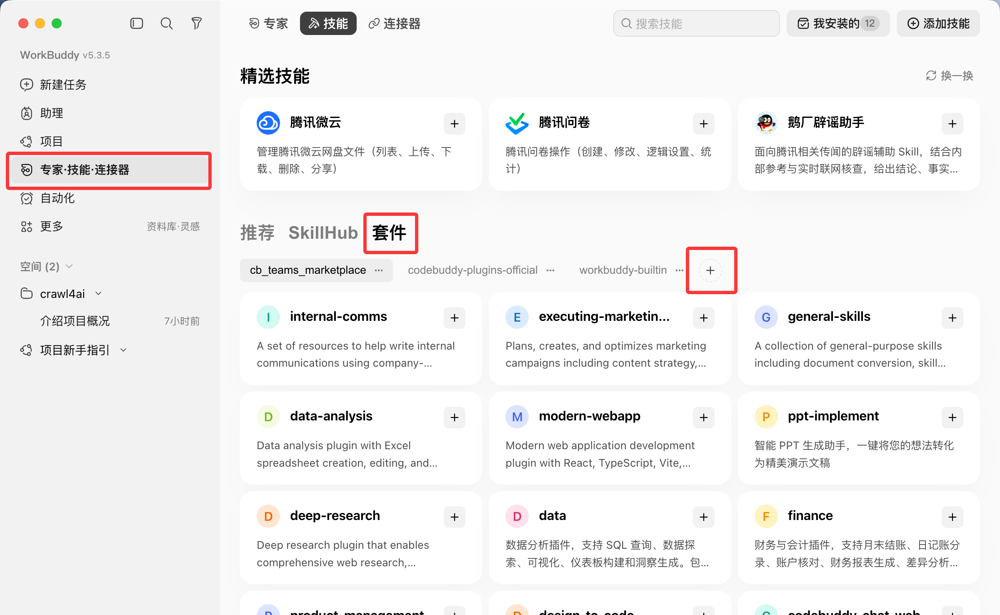
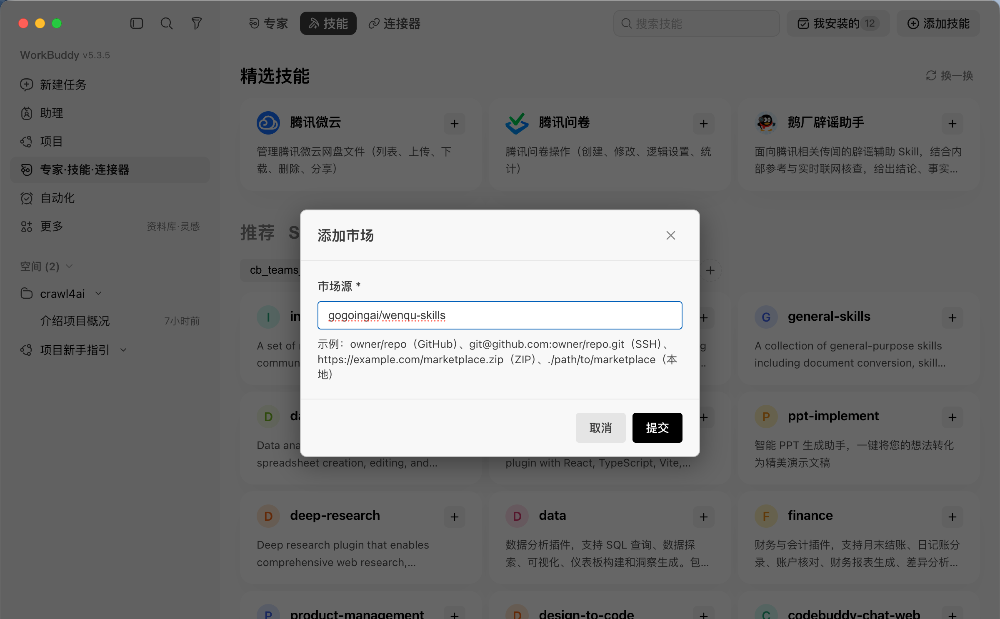
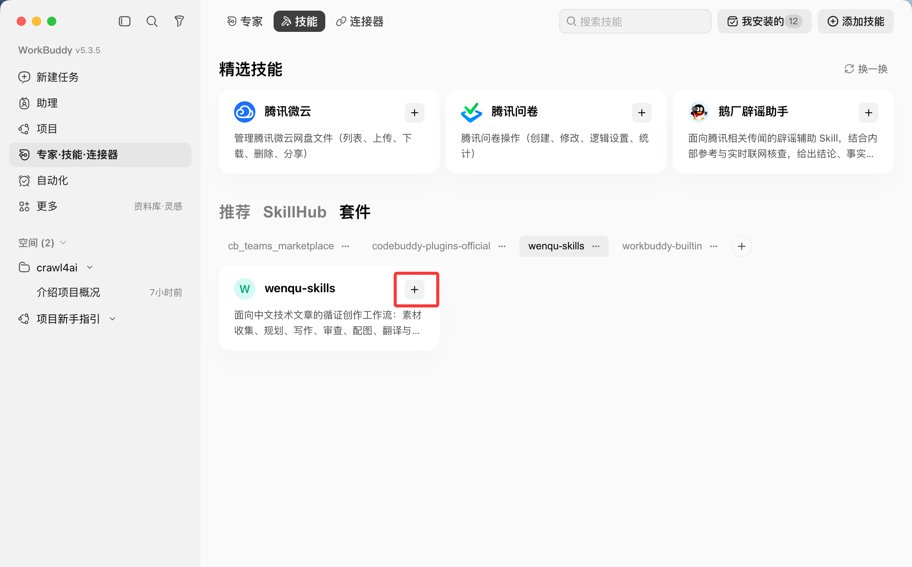
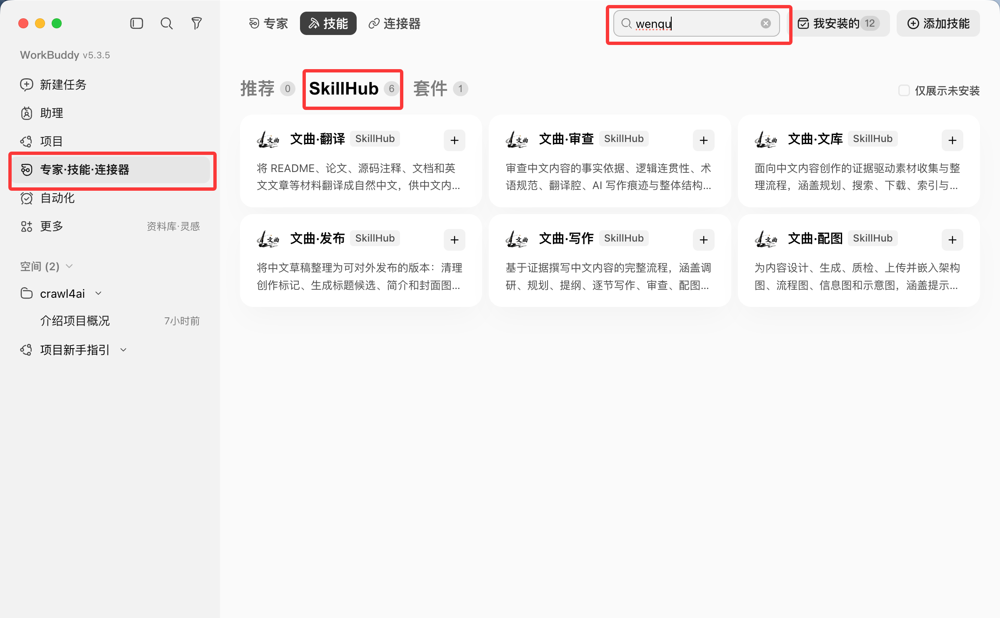
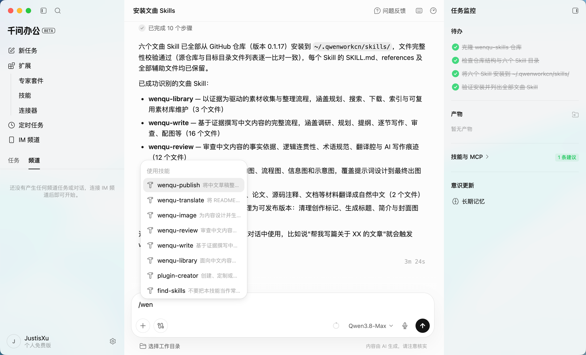
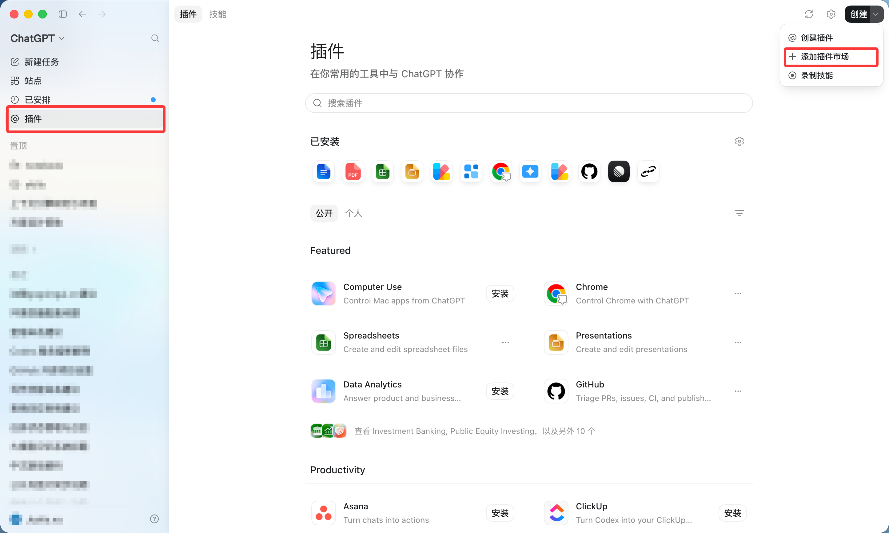
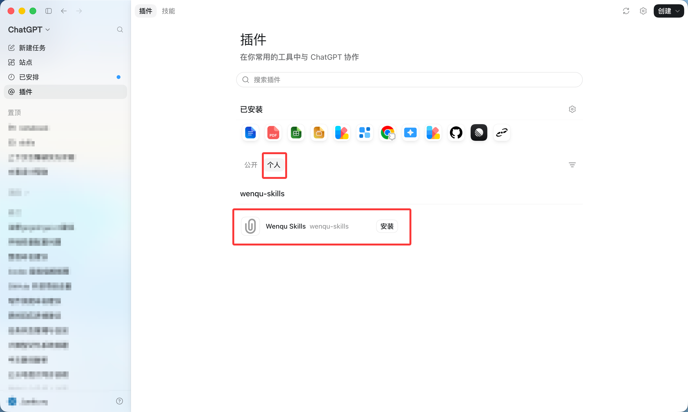

# 文曲（Wenqu Skills）

[English](README.en.md) | [简体中文](README.md)

> 一套面向 AI Agent 的完整文章创作工作流。


文曲取意于文曲星，遵循中国传统文章创作路径，从博观积累、谋篇布局，到属文成篇、推敲润色，最终完成文章发布。

文曲将传统文章创作方法与现代 Agent 能力结合，由多个专业化技能协同，覆盖从素材积累、文章撰写、质量优化到发布输出的完整流程。

## 创作流程

```text
博观积累 -> 谋篇布局 -> 属文成篇 -> 推敲润色 -> 校勘审定 -> 丹青绘意 -> 译笔传意 -> 刊行成章
```

不同技能各覆盖其中若干阶段，彼此衔接成完整创作链路。

## 技能组成

| 技能 | 创作阶段 | 作用 |
| --- | --- | --- |
| [`wenqu-library`](wenqu-library/) | 博观积累 | 素材收集与整理：按“规划、搜索、下载、整理”四步收集素材，以 agent 原生搜索为主、`wenqu library` 补充候选并抓取网页（含微信公众号），为文章、报告与教程整理出可复用素材。 |
| [`wenqu-write`](wenqu-write/) | 谋篇布局、属文成篇 | 中文内容创作主流程：完成需求理解、规划与结构设计、逐节写作与内容完善，并协调其他技能完成翻译、配图与审查。 |
| [`wenqu-review`](wenqu-review/) | 推敲润色、校勘审定 | 内容质量优化：检查事实依据与逻辑结构、表达方式与英文术语、翻译腔与 AI 写作痕迹，并提供修改建议。 |
| [`wenqu-image`](wenqu-image/) | 丹青绘意 | 内容视觉设计：规划配图需求，生成图片提示词，完成 AI 生图、质量检查和上传流程。 |
| [`wenqu-translate`](wenqu-translate/) | 译笔传意 | 跨语言内容转换：将英文材料转换为符合中文表达习惯的内容。 |
| [`wenqu-publish`](wenqu-publish/) | 刊行成章 | 发布版本整理：清理创作痕迹，生成标题、简介、封面等发布素材，输出最终发布版本。 |

## 设计理念

中国传统文章创作讲究：

> 博观而约取，厚积而薄发。

文章并非一次生成，而是在长期积累、反复推敲和持续完善中形成。

文曲希望将这一创作过程融入 AI Agent，使文章创作不再是一次性生成，而是可积累、可持续演进的创作体系。

## 安装完整工作流

> 推荐：通过 [WorkBuddy](#workbuddy) 体验文曲。WorkBuddy 的 hy3 模型免费，每天可领 100 积分。

文曲按完整工作流设计，使用 [`npx skills`](https://github.com/vercel-labs/skills) 一次安装全部六个技能：

```bash
npx skills add gogoingai/wenqu-skills --all -g
```

- `--all`：安装全部技能，并安装到检测到的 Agent。
- `-g`：安装到用户全局目录。

> 如果安装时看到 `eve`/`promptscript does not support global skill installation` 报错，可以忽略--`npx skills` 工具内置的 agent 中，只有这两个不支持全局安装（工具自身的限制，与本仓库无关），其余 agent（包括 Claude Code）不受影响，照常安装成功。

更新已安装的技能：

```bash
npx skills update -g
```

### WorkBuddy

WorkBuddy 内置 **SkillHub** 目录，可逐个安装文曲技能。WorkBuddy 当前 hy3 模型免费，每天可领 100 积分，适合免费体验文曲全流程。

<!-- 文曲套件（wenqu-skills 插件包）的整包安装方式暂时隐藏；如需恢复，取消本注释即可，并把上面的开头描述改回“两条安装路径”。
#### 市场（GitHub 源）

要直接从本仓库安装完整工作流，请使用下面的“市场”流程。

1. 打开“专家·技能·连接器”，选择“技能”，切到“市场”页签后点击 **+**。

   

2. 输入仓库来源并提交：

   ```text
   gogoingai/wenqu-skills
   ```

   

3. 选择新增的 `wenqu-skills` 市场，在 **Wenqu Skills** 卡片上点击 **+**，开始安装。

   

4. 等待插件出现在“我安装的”中，再重载或重启 WorkBuddy，让技能出现在列表中。
-->

打开“专家·技能·连接器”，切到 **SkillHub** 页签，搜索 `wenqu`，在想安装的技能卡片上点击 **+**。WorkBuddy 会显示六个独立的文曲技能：文库、写作、审查、配图、翻译与发布。



SkillHub 中的每个技能都有各自的目录版本和审核状态；它们不是 GitHub 市场里的整包插件。

### 千问 Work（Qwen Work）

[千问 Work](https://qwenwork.cn/) 已上线文曲技能支持，技能目录位于 `~/.qwenworkcn/skills/`。在千问 Work 中发送下面的提示词，即可自动下载仓库并安装全部六个文曲技能：

```text
请从 https://github.com/gogoingai/wenqu-skills 下载仓库，将仓库根目录下的以下六个 Skill 分别安装到 ~/.qwenworkcn/skills/：wenqu-library、wenqu-write、wenqu-review、wenqu-image、wenqu-translate、wenqu-publish。请保留每个 Skill 目录中的 SKILL.md、references 及其他辅助文件。安装完成后，列出已经成功识别的全部文曲 Skill。
```



### Claude Code 插件市场

先添加文曲市场，再安装唯一的 `wenqu-skills` 插件；它包含全部六个技能：

```text
/plugin marketplace add gogoingai/wenqu-skills
/plugin install wenqu-skills@wenqu-skills
/reload-plugins
```

`/reload-plugins` 用于让当前 Claude Code 会话立即加载刚安装的技能；新开会话时无需重复执行。市场或插件有新版本时，依次更新：

```text
/plugin marketplace update wenqu-skills
/plugin update wenqu-skills@wenqu-skills
/reload-plugins
```

### Codex 插件市场

Codex 可直接识别本仓库的插件市场，并安装包含全部六个技能的完整 `wenqu-skills` 插件包。

1. 在左侧边栏打开“插件”，选择“创建”->“添加插件市场”。

   

2. 输入下面的仓库来源，**Git 引用**和**稀疏路径**保持为空，然后添加市场：

   ```text
   gogoingai/wenqu-skills
   ```

3. 切到“个人”页签，找到 **Wenqu Skills**，点击“安装”。

   

安装后新开一个 Codex task，让新会话加载插件中的技能。

### SkillHub 网站或 agent 安装

[SkillHub](https://skillhub.cn) 也支持通过 agent 安装全部技能，可发送：

> 请根据 [https://skillhub.cn/install/skillhub.md](https://skillhub.cn/install/skillhub.md)，安装 wenqu-library、wenqu-write、wenqu-review、wenqu-image、wenqu-translate、wenqu-publish。

### ClawHub（OpenClaw）

[ClawHub](https://clawhub.ai) 是 OpenClaw 生态的技能与插件市场，文曲主页：<https://clawhub.ai/gogoingai>。推荐安装 `wenqu-skills` 插件包，一次获取全部六个技能：

```bash
openclaw plugins install clawhub:@gogoingai/wenqu-skills
```

也可以逐个安装技能：

```bash
openclaw skills install @gogoingai/wenqu-library
openclaw skills install @gogoingai/wenqu-write
openclaw skills install @gogoingai/wenqu-review
openclaw skills install @gogoingai/wenqu-image
openclaw skills install @gogoingai/wenqu-translate
openclaw skills install @gogoingai/wenqu-publish
```

更新：插件包用 `openclaw plugins update --all`，逐个安装的技能用 `openclaw skills update`。

## 依赖

- [`wenqu-cli`](https://github.com/gogoingai/wenqu-cli)：为 `wenqu-image` 和 `wenqu-library` 提供运行时。

### `wenqu-image`

`wenqu-image` 支持五条生图路径：已登录的 Codex、OpenAI GPT Image、OpenRouter、通义万相和豆包 Seedream。安装后可先检查本机环境：

```bash
wenqu image doctor --json
```

Codex 路径需要 `codex login`；其他 API 密钥仅写入本机
`~/.gogoingai/wenqu-skills/image/credentials.env`，默认模型、画幅与可选 API 地址写入同目录
`config.json`。文章可在 `wenqu-skills/{文章文件名}/config/image.json` 覆盖模型选择，不能保存密钥或地址。

```bash
wenqu image generate \
  --provider dashscope --model qwen-image-2.0-pro --ar 16:9 \
  --prompt "一张中文技术架构示意图" --out /tmp/diagram --timeout-sec 300 --upload
```

`--upload` 由 CLI 自己调用已配置的 PicGo。

### `wenqu-library`

`wenqu-library` 每次都先运行 agent 自带的联网搜索；受管的 `wenqu library` 命令只负责补充多引擎候选和增强下载。它内置 Crawl4AI 适配：百度、必应、Brave 与搜狗直连失败时可做一次浏览器回退；下载支持动态网页、受限同源抓取和已确认的微信公众号 URL，失败时自动回退 agent 自带能力。

完整的引擎选择、CLI 参数和站点抓取策略见 [`wenqu-library/references/wenqu-cli.md`](wenqu-library/references/wenqu-cli.md)。

## 维护与发布

技能、清单、版本、图片资源和发布配置的任何改动都必须通过 PR 合入 `master`，不得直接推送。每个 PR 会自动运行 Skills Eval，并在 PR 评论中展示格式、安全以及 Claude Code、WorkBuddy、ClawHub 的原生校验报告。

维护者请先阅读 [开发手册](DEVELOPMENT.md)；涉及版本和平台发布时，再按 [发布手册](RELEASE.md) 在 PR 合入后执行。
